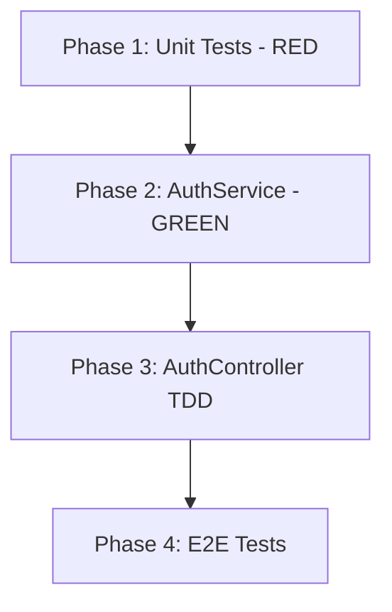

# 📋 Implementation Plan: TDD Sign-Up API

## 📋 Overview

**Objective**: Implement Sign-Up API using TDD (Test-Driven Development) approach for the Quiz App Backend

**Scope**:
- ✅ Included: Unit tests, E2E tests, AuthService, AuthController, AuthModule
- ❌ Excluded: JWT authentication, login API, password reset, email verification

**Estimated Effort**: M (Medium) — 3-4 phases

**TDD Approach**: RED → GREEN → REFACTOR for each component

---

## 🔗 Prior Deliverables Referenced

- **Per RESEARCH-tdd-signup-api.md**: Follow Red-Green-Refactor cycle, use `@nestjs/testing`, mock repositories
- **Per SCOUT-tdd-signup-api.md**: Follow existing test patterns, use path aliases `@/`, fix SignUpDto validation

---

## 🏗️ Architecture

### Component Flow
```
POST /auth/sign-up
    ↓
AuthController.signUp(SignUpDto)
    ↓
AuthService.signUp(dto)
    ├── Validate password match
    ├── Check email uniqueness
    ├── Hash password with bcrypt
    └── Create & save User
    ↓
Return user data (without password)
```

### Files to Create/Modify (TDD Order)

| Order | File | Action | TDD Step |
|-------|------|--------|----------|
| 1 | `src/auth/auth.service.spec.ts` | Modify | RED - Write failing tests |
| 2 | `src/auth/auth.service.ts` | Create | GREEN - Implement to pass |
| 3 | `src/auth/auth.module.ts` | Create | Setup module |
| 4 | `src/auth/auth.controller.spec.ts` | Create | RED - Controller tests |
| 5 | `src/auth/auth.controller.ts` | Create | GREEN - Controller impl |
| 6 | `src/app.module.ts` | Modify | Import AuthModule |
| 7 | `src/main.ts` | Modify | Add ValidationPipe |
| 8 | `test/auth.e2e-spec.ts` | Create | E2E integration tests |
| 9 | `src/auth/dto/sign-up.dto.ts` | Modify | Fix password match validation |

---

## 📊 Phases

### Phase 1: Unit Tests for AuthService (TDD - RED) ⬜

**Goal**: Write comprehensive failing unit tests for AuthService.signUp()

**Checkpoint**: All tests written and failing (RED state)

**Tasks**:

- [ ] **Task 1.1**: Setup test file with proper mocks
  - Import `Test` from `@nestjs/testing`
  - Create mock for User repository (`mockUserRepository`)
  - Mock bcrypt hash function
  - Use `getRepositoryToken(User)` for repository injection

- [ ] **Task 1.2**: Write happy path test
  - Test: `should create a new user with hashed password`
  - Input: Valid SignUpDto
  - Expected: User created, password hashed, returns user without password

- [ ] **Task 1.3**: Write validation tests
  - Test: `should throw BadRequestException when passwords do not match`
  - Test: `should throw ConflictException when email already exists`

- [ ] **Task 1.4**: Run tests to confirm they FAIL (Red state)
  - Command: `pnpm test auth.service`
  - All tests should fail (AuthService doesn't exist yet)

---

### Phase 2: AuthService Implementation (TDD - GREEN) ⬜

**Goal**: Implement AuthService to make all unit tests pass

**Checkpoint**: All unit tests passing (GREEN state)

**Tasks**:

- [ ] **Task 2.1**: Create AuthService class
  - File: `src/auth/auth.service.ts`
  - Inject `Repository<User>` via `@InjectRepository(User)`
  - Add `signUp(dto: SignUpDto)` method signature

- [ ] **Task 2.2**: Implement password validation
  - Compare `dto.password` with `dto.confirmPassword`
  - Throw `BadRequestException` if mismatch

- [ ] **Task 2.3**: Implement email uniqueness check
  - Query repository: `findOne({ where: { email: dto.email } })`
  - Throw `ConflictException` if exists

- [ ] **Task 2.4**: Implement password hashing
  - Use `bcrypt.hash(dto.password, SALT_ROUNDS)`
  - Add `SALT_ROUNDS = 10` constant

- [ ] **Task 2.5**: Implement user creation
  - Create user with `repository.create()`
  - Save with `repository.save()`
  - Return user object without password field

- [ ] **Task 2.6**: Create AuthModule
  - File: `src/auth/auth.module.ts`
  - Import `TypeOrmModule.forFeature([User])`
  - Register AuthService as provider

- [ ] **Task 2.7**: Run tests to confirm they PASS
  - Command: `pnpm test auth.service`
  - All tests should pass (Green state)

---

### Phase 3: AuthController with TDD ⬜

**Goal**: Create AuthController using TDD approach

**Checkpoint**: Controller unit tests passing

**Tasks**:

- [ ] **Task 3.1**: Create AuthController unit tests (RED)
  - File: `src/auth/auth.controller.spec.ts`
  - Mock AuthService
  - Test: `should call authService.signUp with correct dto`
  - Test: `should return created user`

- [ ] **Task 3.2**: Implement AuthController (GREEN)
  - File: `src/auth/auth.controller.ts`
  - Add `@Controller('auth')` decorator
  - Add `@Post('sign-up')` endpoint
  - Use `@Body()` to get SignUpDto
  - Use `@HttpCode(HttpStatus.CREATED)` for 201 response

- [ ] **Task 3.3**: Update AuthModule
  - Add AuthController to controllers array

- [ ] **Task 3.4**: Import AuthModule in AppModule
  - Modify `src/app.module.ts`
  - Add AuthModule to imports array

- [ ] **Task 3.5**: Run controller tests
  - Command: `pnpm test auth.controller`
  - All tests should pass

---

### Phase 4: E2E Tests & Final Integration ⬜

**Goal**: Create E2E tests and ensure full integration works

**Checkpoint**: All E2E tests passing, API functional

**Tasks**:

- [ ] **Task 4.1**: Add Global ValidationPipe
  - Modify `src/main.ts`
  - Add `app.useGlobalPipes(new ValidationPipe())`

- [ ] **Task 4.2**: Fix SignUpDto password matching
  - Modify `src/auth/dto/sign-up.dto.ts`
  - Replace `@ValidateIf` with custom `@Match('password')` decorator
  - Create custom validator or use manual validation in service

- [ ] **Task 4.3**: Create E2E test file
  - File: `test/auth.e2e-spec.ts`
  - Follow pattern from `test/app.e2e-spec.ts`
  - Add ValidationPipe in beforeEach

- [ ] **Task 4.4**: Write E2E test cases
  - Test: `POST /auth/sign-up` with valid data → 201 Created
  - Test: `POST /auth/sign-up` with duplicate email → 409 Conflict
  - Test: `POST /auth/sign-up` with invalid email → 400 Bad Request
  - Test: `POST /auth/sign-up` with short password → 400 Bad Request
  - Test: `POST /auth/sign-up` with mismatched passwords → 400 Bad Request

- [ ] **Task 4.5**: Run E2E tests
  - Command: `pnpm test:e2e`
  - Ensure database is available (Docker)
  - All tests should pass

- [ ] **Task 4.6**: Manual API verification
  - Start app: `pnpm start:dev`
  - Test with curl or Swagger UI
  - Verify response format

---

## ⚠️ Risks & Mitigations

| Risk | Impact | Mitigation |
|------|--------|------------|
| Database not available for E2E | High | Use Docker compose, add setup instructions |
| Bcrypt types mismatch | Medium | Already have `@types/bcrypt` installed |
| Password validation logic complexity | Medium | Use service-level validation, not just DTO |
| Unique constraint error handling | Medium | Catch TypeORM error, convert to ConflictException |

---

## 📅 Dependencies



---

## ✅ Success Criteria

- [ ] All unit tests pass: `pnpm test` shows 100% for auth files
- [ ] All E2E tests pass: `pnpm test:e2e` shows green
- [ ] TDD workflow followed: Tests written BEFORE implementation
- [ ] Password stored hashed (not plain text)
- [ ] Duplicate email returns 409 Conflict
- [ ] Invalid input returns 400 Bad Request with validation details
- [ ] Response excludes password field

---

## 📝 Test Coverage Requirements

| File | Min Coverage |
|------|--------------|
| `auth.service.ts` | 90%+ |
| `auth.controller.ts` | 80%+ |

---

## 🚀 Commands Reference

```bash
# Run unit tests (watch mode)
pnpm test:watch

# Run specific test file
pnpm test auth.service

# Run with coverage
pnpm test:cov

# Run E2E tests
pnpm test:e2e

# Start development server
pnpm start:dev
```
